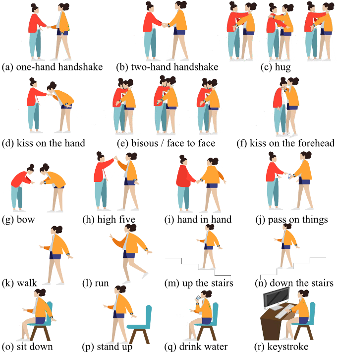

# SoDA: Social Distancing Alert with Smartwatches

## Prerequisite

* numpy
* pandas
* scipy
* torch
* tqdm


## How to run

0. Download datasource from [here](https://drive.google.com/file/d/1yhcPKftYk1LkKfvoGo0BahsFiPYFVdPo/view?usp=sharing).

1. "git clone" this repository.  

2. Run ./data_prepare.sh

    Based on different strategy split datasource into training set and testing set.

3. Run ./run.sh

    Under the same splitting strategy train specific model.

## Dataset

We recruit 10 subjects and let them wear a smartwatch branded Samsung Gear Sport on the left wrist.

Subjects are required to repeat 18 actions for 10 times.

During the activity conducted, data of accelerometers and gyroscopes as well as corresponding timestamps are recorded, resulting in a dataset with 1800 samples.

### Actions



### Description

The file name with the format of  "I_J_K.mat".

- **I**(1 - 10): the I-th subject.
- **J**(1 - 18): the J-th action.
- **K**(0 - 9): the K-th repetition.

Every mat file contains three keys:
- **accData**(1, 3, sequence length): A sequence of the accelerometer readings.
- **gyrData** (1, 3, sequence length): A sequence of the gyroscope readings.
- **label**(1, sequence length): Action labels for each sample point.

## Citation
```
@article{wang2022social,
  title={Social Distancing Alert with Smartwatches},
  author={Wang, Xin and Wu, Xilei and Meng, Huina and Fan, Yuhan and Shi, Jingang and Ding, Han and Wang, Fei},
  journal={arXiv preprint arXiv:2205.06110},
  year={2022}
}
```